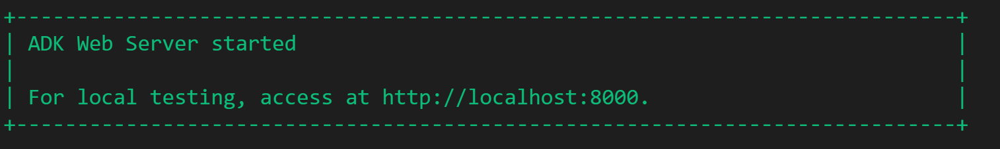
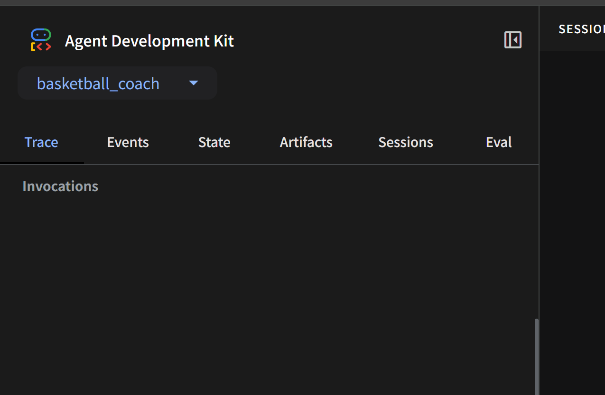

<div align="center">

# 🏀GlideHoop —— 你的篮球好伙伴🐧
[![License][License-image]][License-url]
[![Releases][Releases-image]][Releases-url]
[![Installation][Installation-image]][Installation-url]
![PythonVersion][PythonVersion-image]

[![page][page-image]][page-url]
[![tech report][report-image]][report-url]

🌐 [English](README.en.md) &nbsp;|&nbsp; **简体中文**
</div>

[page-image]: https://img.shields.io/badge/Page-know_more-black?style=flat-square
[License-image]: https://img.shields.io/github/license/LHS183019/AIBasicFinalProject?style=flat-square&color=brown
[Releases-image]: https://img.shields.io/github/v/release/LHS183019/AIBasicFinalProject?style=flat-square
[Installation-image]: https://img.shields.io/github/downloads/LHS183019/AIBasicFinalProject/total?style=flat-square&color=blue
[PythonVersion-image]: https://img.shields.io/badge/Python-3.11-yellow?style=flat-square&labelColor=blue
[report-image]: https://img.shields.io/badge/Tech_report-download-black?style=flat-square

[page-url]: https://lhs183019.github.io/AIBasicFinalProject/
[License-url]: https://github.com/LHS183019/AIBasicFinalProject/blob/main/COPYING
[Releases-url]: https://github.com/LHS183019/AIBasicFinalProject/releases
[Installation-url]: https://github.com/LHS183019/AIBasicFinalProject
[PythonVersion-url]: https://github.com/LHS183019/AIBasicFinalProject/pulls
[report-url]: https://github.com/LHS183019/AIBasicFinalProject/blob/main/aibasis_report/main.pdf

---


## ✨ 最近更新 (v1.4.1 - 2025.06.29)
<div align="center">

| 类型       | 描述 |
| :--------- | :---------------------------- |
| 🐛 Bug 修复 | 修复了策略制定策略显示不完整的问题 |
| ⚡ 优化 | 对本地库管理和生图功能进行了使用优化 |
| 📚 文档更新 | 初步用户指南上线<br>README更新了示范、安装指南和常见问题解答 |
| 🧹 代码清理 | 移除了部分冗余的代码 |

</div>

## 📖 历史更新日志

<details>
  <summary><b>v1.4.0 (2025.06.27)</b></summary>
+ 🎉 首次发布：核心功能上线
</details>

<details>
  <summary><b>v1.0.0 - v1.3.0</b></summary>

  + 内部开发，非公开阶段
</details>

## 💡 即将上线

<details>
  <summary><b>拟人化Agent助手！</b></summary>
+ 将为您的GlideHoop团队赋予有趣的人格设置
+ 修复Agent回答风格不一致问题体验
</details>

<details>
  <summary><b>WNBA, NBA百科全书</b></summary>
  + 为我们的search browser接入balldontlie API，提供更专业的球星百科
  + 为我们的search browser更新对Basketball Reference等网站的Web search功能，实时提供球星资讯
</details>

<details>
  <summary><b>球鞋选购👟</b></summary>
  + 更新RAG语料库，提供专业选购意见
</details>

---
## ✨ 功能演示
<!-- 
<details open>
  <summary><b>🚀 用户注册与登录</b></summary>
  <p>这是一个简短的 GIF，演示了用户如何快速注册新账户并登录系统。</p>
  <p align="center">
    
  </p>
</details>

<details>
  <summary><b>📝 创建与编辑任务</b></summary>
  <p>该 GIF 展示了任务的创建、编辑、标记完成以及删除操作。</p>
  <p align="center">
    
  </p>
</details>

<details>
  <summary><b>📊 数据可视化仪表盘</b></summary>
  <p>此视频演示了用户如何通过交互式仪表盘查看项目数据的统计分析。</p>
  <p align="center">
    
  </p>
</details>

<details>
  <summary><b>更多功能演示...</b></summary>
  <p>等等，还有更多演示...</p>
  <p align="center">
    
  </p>
</details>

### 更多功能 -->

<!-- * [完整功能说明](FEATURES.md) -->
* [演示&讲解视频](https://your-project-demo.com)


## 🆓申请试用（完全免费）

目前，GlideHoop 的部分核心功能依赖于我们部署在 Google Cloud 上的语料库和云服务。因此，我们暂时需要为您提供访问授权。

如果您对 GlideHoop 感兴趣，并希望抢先体验，请随时通过以下邮箱联系我们申请试用，我们会尽快回复您：

* 📧 **lhs183019@gmail.com**
 

感谢您的支持！我们理解本地部署的重要性，会尽快提供能让GlideHoop完全在本地运行的解决方案💡


## 🔥在您的电脑上尝试

遵循以下步骤，您将能够轻松地启动GlideHoop🐧


#### 环境配置

**第一步：下载我们的repo至您的电脑**

```bash
git clone https://github.com/YourUsername/AIBasicFinalProject.git
cd AIBasicFinalProject
```

+ 您也可以用其他非CLI的方式下载

```yaml
AIBasicFinalProject/   <-- 您应该在此目录
├── basketball_coach/       
│   ├── __init__.py         
│   └── agent.py            
├── requirements.txt        
└── .env                    
```

<br>

**第二步：创建与激活 Python 虚拟环境（推荐）**

暂时地，GlideHoop还没有确认对其他版本Python的支持，最好保持使用 Python 3.11。


<details open>
<summary><b>使用 <code>venv</code></b></summary>
<br>

**⚠️前置条件** 您的系统中已安装 **Python 3.11**，可以从 [Python 官方网站](https://www.python.org/downloads/release/python-3110/) 下载并安装。

```bash
# 这将在当前项目根目录下创建一个名为 '.venv' 的文件夹
python3.11 -m venv .venv

# macOS / Linux 用户请执行：
source .venv/bin/activate

# Windows CMD 用户请执行：
.venv\Scripts\activate.bat

# Windows PowerShell 用户请执行：
.venv\Scripts\Activate.ps1
```
激活后，您的终端提示符前会显示 `(.venv)`，表明您已成功进入虚拟环境！

</details>

<details>
<summary><b>使用 <code>conda</code></b></summary>

```bash
# 这将创建一个名为 'glidehoop' (名称可自定义) 的新环境，并安装 Python 3.11。
conda create -n glidehoop python=3.11

conda activate glidehoop
```
激活后，您的终端提示符前会显示 `(glidehoop)`，表明您已成功进入虚拟环境！

</details>

<br>

**第三步：安装项目依赖**

无论您选择了 `venv` 还是 `conda`，在虚拟环境激活后运行：

```bash
pip install -r requirements.txt # 确保您是在刚刚提及的根目录中
```

pip会自动下载所有的依赖项，需要一些等待时间

<br>

**最后一步：**

您需要在根目录配置一个命名为`.env`的文件：
```yaml
AIBasicFinalProject-main/   
├── basketball_coach/       
│   ├── __init__.py         
│   └── agent.py            
├── requirements.txt        
└── .env                    <-- 需要配置这个
```

具体内容可以参考`.env.example`：
```
SILICONFLOW_API_KEY=你的siliconflow_key（可选、不必要）

GOOGLE_CLOUD_PROJECT="basketball-coach-rag"
GOOGLE_CLOUD_LOCATION="us-central1"
GOOGLE_GENAI_USE_VERTEXAI="True"
GOOGLE_APPLICATION_CREDENTIALS="basketball_coach//service_key.json"
RAG_CORPUS = "projects/basketball-coach-rag/locations/us-central1/ragCorpora/4532873024948404224"
```

然后把您在前面申请到的key，替换掉`service_key.json`中的内容。

```yaml
AIBasicFinalProject-main/   
├── basketball_coach/       
│   ├── __init__.py
│   ├── agent.py         
│   └── service_key.json    <-- 把您的key粘贴到这个里面        
├── requirements.txt        
└── .env                    
```


#### 启动对话！

```yaml
AIBasicFinalProject-main/   <-- 在此目录中
├── basketball_coach/       
│   ├── __init__.py         
│   └── agent.py            
├── requirements.txt        
└── .env                    
```

运行以下代码：
```
adk web
```

adk将会在本地设置伺服器，最后会打印设置信息，包括本地伺服器的url（形如`http://127.0.0.1:8000/`）


拷贝这个url，在浏览器中打开。

在左上角下拉选单中选择"basketball_coach"作为对话agent


然后就可以开始调试和使用啦。
+ 关于这个界面的使用，可以参考我们的[指南](https://lhs183019.github.io/AIBasicFinalProject/)
+ 关于这个界面的设计，可以[参考官方介绍](https://github.com/google/adk-web?tab=readme-ov-file)

您还可以在CLI中运行我们的Agent，只需要把`adk web`改为：
```bash
adk run multi_tool_agent
```
+ **注意**：并不推荐使用CLI运行，因为我们还没有做此模式下的功能兼容性完善


## 🛠️ 您可能遇到的问题

### 🚨 配置问题

  * **问题：缺少 SSL 认证**

      * **解决：** 请在命令行中运行以下命令，确保 SSL 证书路径正确配置。
        ```bash
        # macOS / Linux 用户 / git bash：
        export SSL_CERT_FILE=$(python -m certifi)
        # CMD用户：
        for /f "del delims=" %i in ('python -m certifi') do set SSL_CERT_FILE=%i
        # PowerShell用户：
        $env:SSL_CERT_FILE = python -m certifi
        ```
      * **提示：** 如果 `certifi` 模块未安装，您可能需要先执行 `pip install certifi`

  * **问题：JSON 解码错误**

      * **解决：** 请确认您的 `.env` 文件的编码格式为 **UTF-8**。您可以使用记事本等文本编辑器打开 `.env` 文件，手动将其编码格式修改为 UTF-8 后保存。

  * **问题：JWT 认证无效 (`JWT invalid`)**

      * **解决：**
        1.  首先，请仔细检查您是否已按照项目指引，正确配置了 `service_key.json` 文件。
        2.  如果配置无误，则可能是分配给您的密钥因安全原因被暂时禁用，请联系我们为您重新发送key👆


### 🚧 功能性 Bug

  * **流式响应报错：JSON 编码错误 (使用 ADK Web 时)**

      * **现象：** 当您在ADK WEB中使用流式响应功能时，可能会偶发 JSON 编码报错。
      * **临时解决：**
          * 您可以尝试多提交几次您的问题。
          * 建立一个新的对话。
          * 暂时关闭流式响应功能。
          * 如果必须要体验完整的流式响应，可以改用CLI运行方式
      * **补充：** 这个报错大概是由ADK web本身对长文本流式相应的处理问题，[可见issue](https://github.com/google/adk-web/issues/74)

  * **对话生成等待时间过长**

      * **现象：** 对话或任务生成过程耗时过长，远超预期
      * **临时解决：**
          * 这通常是瞬时错误导致，请尝试将当前任务重新提交一遍（即使 Agent 提示您结果正在生成）。
          * 如果问题仍然存在，请尝试重新开启一个新的对话。
      * **补充：** 只有**战术可视化生成**任务会比较耗时，其他任务大多数都能在 1 分钟内给出结果。您也可以通过运行中的命令行来监控 Agent 之间的对话是否正常进行。

  * **语音生成失败**
      * **现象：** 被告知语音服务不成功
      * **原因：**
          * Gemini-2.5预览版语音服务暂不适用。

我们会尽快修复以上问题，以提供更稳定的使用体验！