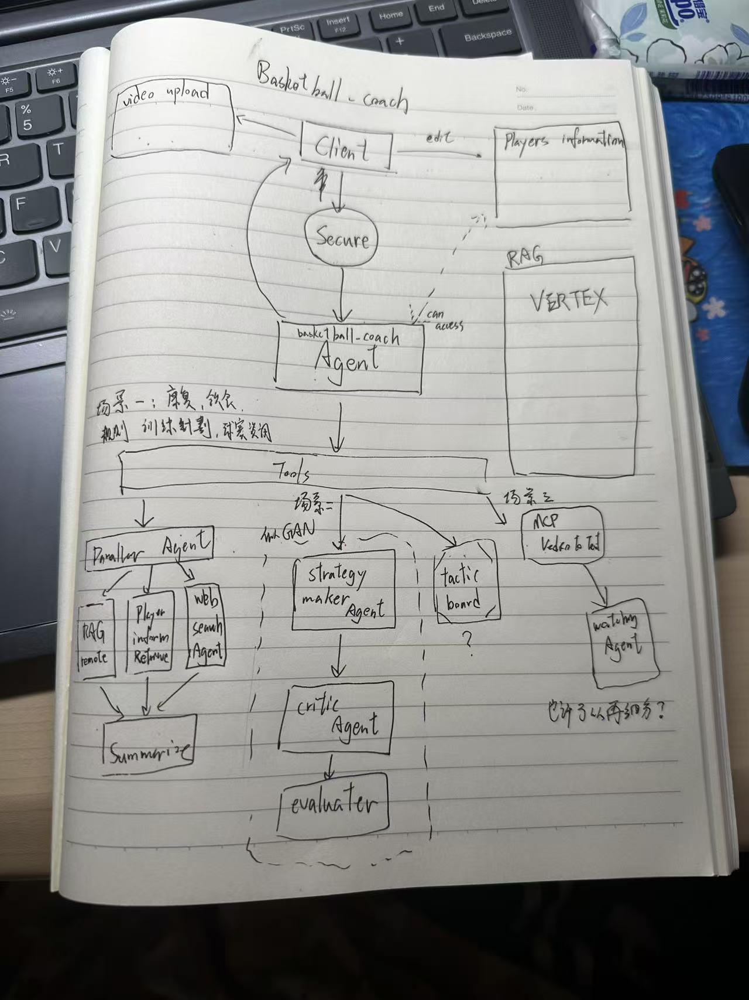

# 新開發手冊



潦草的架构草稿。（等待被figma）

## 产品
三个场景
+ 知识咨询
+ 策略制定
+ 影片分析

三个应用优势
+ 个性化球员资料记录
+ 功能集成
+ 战术板呈现（如果能做出来的话）

三个......

## 新分工
+ 数据构建
    + 设计相关的文件结构
    + 在Vertex AI上搭建RAG
        + 可以参考soccer brench
        + 专业书籍/权威资料/案例经验/术语 etc. 导入
        + 写一个简单的Agent测试成效
    + 顺便研究Vertex上怎么部署
    + 用户的本地球员数据库设计
    + 影片与影片标识符如何对应
+ Agent系统搭建
    + 把架构图里的结构用代码写出来
    + 确定具体应用的工具和技术（什么tool什么MCP 操作战术板是否可行）
    + 尽可能满足作业列出的要求
    + 确保用户交互不出问题（至少adk web没问题）
+ Prompt工程
    + prompt.py
    + 填充、优化系统架构的提示词（搭到哪写到哪）（工作量不可小觑这是血肉所在啊......）
    + 作业要求的temperature调参报告
+ 收尾
    + 模型测试（evaluation）
    + 用户手册+部署方案
    + 真实用户使用收集(以及star)
    + 写实践报告
    + 演示视频

**ddl：6.27**

在我们的repo上面有一个`development-googleADK`的branch，我的所有更新都会放上面！大家有需要pull一下就好。


## 环境配置

我电脑上的python版本为`3.11.13`, 建议使用`3.11.x`的python~。

你需要在工作目录根目录配置.env文件
```
SILICONFLOW_API_KEY=你的siliconflow_key
GOOGLE_API_KEY=你的GEMINI_key
GOOGLE_GENAI_USE_VERTEXAI=FALSE
```

以及下载需要用到的一些依赖，在你的环境中运行：
```
pip install -r requirements.txt
```
`requirements.txt`在根目录中


## 注意事项

### 更新requiements.txt
你在开发过程中可能新增了对一些第三方库的使用，导致需求的更新。如果发生这种情况，可以在工作路径下面执行:

```
pipreqs . --encoding=utf8 --force
```

来生成新的`requirements.txt`

你可能需要先在当前环境中安装pipreqs这个库:

```
pip install pipreqs
```

### 代码即文档
注意类、方法、函数、变量命名的可读性。
不要忘记留下必要的docstring和comment。


## ！IMPORTANT，推荐使用的资源


### Document Link
+ （需要VPN）Gemini API [doc](https://ai.google.dev/gemini-api/docs/openai?hl=zh-cn)
+ （需要VPN）Google ADK [doc](https://google.github.io/adk-docs/)
+ Siliconflow API [doc](https://docs.siliconflow.com/cn/userguide/introduction)

### Prompt调试工具
+ (LLM app)[Gemini](https://gemini.google.com/app)
+ (Playground)[Gemini](https://aistudio.google.com/prompts/new_chat)
+ (Playground)[Deepseek & Qwen](https://cloud.siliconflow.cn/sft-1r2jguazql/models?tags=Tools)
+ (AI助手)[Prompt 优解](https://console.volcengine.com/ark/region:ark+cn-beijing/autope/startup)
+ (AI助手)[Prompt Pilot](https://promptpilot.volcengine.com/home?utm_campaign=20250606&utm_content=Ark_PromptPilot&utm_medium=in_mkt&utm_source=Data_AML&utm_term=Ark)

### Prompt准则和示范样例
+ (其他篮球Agent)[豆包](https://www.doubao.com/chat/9575882336265218)
+ (其他篮球Agent)[GPT](https://www.yeschat.ai/gpts-2OTocBQSF4-Pro-basketball-gpt)
+ (文档)各类型prompt规范参考[LLM Agent](https://google.github.io/adk-docs/agents/llm-agents/)
+ (文档)各类型prompt规范参考[LLM Agent 和 tool设置](https://google.github.io/adk-docs/tutorials/agent-team/#step-1-your-first-agent-basic-weather-lookup)
+ (文档)各类型prompt规范参考[Agent 与 sub Agent](https://google.github.io/adk-docs/tutorials/agent-team/#step-3-building-an-agent-team-delegation-for-greetings-farewells)
+ (文档)各类型prompt规范参考[Adding Safety](https://google.github.io/adk-docs/tutorials/agent-team/#step-5-adding-safety-input-guardrail-with-before_model_callback)
+ (文档)各类型prompt规范参考[用LLm来做SafetyGuardrail](https://google.github.io/adk-docs/safety/#using-gemini-as-a-safety-guardrail)
+ (github贡献)Agent Example1(相对简单)(https://github.com/google/adk-python/tree/main/contributing/samples)
+ (github贡献)Agent Example2(https://github.com/google/adk-samples/tree/main/python)

### Vertex AI RAG
+ [RAG simple example](https://github.com/google/adk-python/blob/main/contributing/samples/rag_agent/agent.py)
+ [RAG example](https://github.com/google/adk-samples/blob/main/python/agents/RAG/README.md)
+ [Youtube: Build Your First RAG Agent with Agent Development Kit](https://www.youtube.com/watch?v=TvW4A0a75mw)
+ (文档)[测测你的Agent](https://google.github.io/adk-docs/get-started/quickstart/#run-your-agent)
+ (文档)[部署你的Agent](https://google.github.io/adk-docs/deploy/agent-engine/)
+ (文档)[VertexAiRag记忆（示范为对话记忆）](https://google.github.io/adk-docs/sessions/memory/#memoryservice-implementations)
+ (文档)[VertexAiRAG搜寻](https://google.github.io/adk-docs/tools/built-in-tools/#vertex-ai-search)

### 之前note.md遗留的知识视频
#### How to Protect your LLM
https://www.promptingguide.ai/zh/risks/adversarial#%E5%8F%82%E6%95%B0%E5%8C%96%E6%8F%90%E7%A4%BA%E7%BB%84%E4%BB%B6
https://www.youtube.com/watch?v=6bYGhY9HB8k
https://www.youtube.com/watch?v=jrHRe9lSqqA
https://zhuanlan.zhihu.com/p/30480330292

#### What is structured output:
https://www.youtube.com/watch?v=xpvFinvqRCA

##### What is an Agent:
https://openai.github.io/openai-agents-python/
https://zhuanlan.zhihu.com/p/24432308656
https://zhuanlan.zhihu.com/p/657937696
https://www.zhihu.com/question/1894891236617332066/answer/1900585340592424543
https://zhuanlan.zhihu.com/p/32230066307

##### What is agentic workflow:
https://www.anthropic.com/engineering/building-effective-agents
