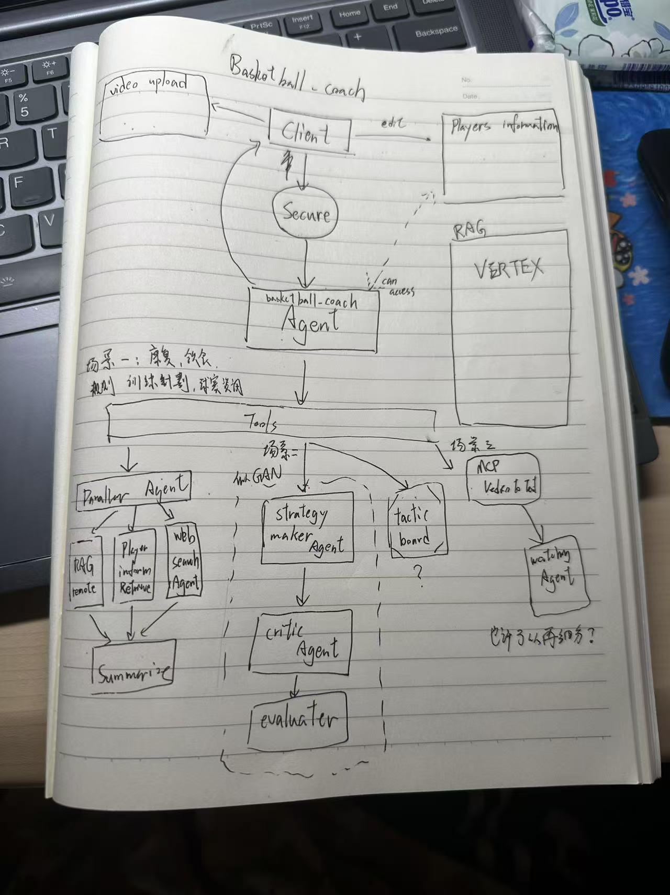

# V3 開發手冊😊


潦草的架构草稿。（等待被figma）


## TODO
+ [ ] training_planner Prompt 精修
+ [ ] training_handbook
+ [ ] player_data_recorder Prompt 精修
+ [ ] player_record_handbook

参考prompt
```
好！我现在要用Google的ADK开发Agent 应用。希望你能协助我撰写给Agent使用的prompt，他需要包含两项内容”description“和”intruction“，description用于向其他的Agent解释这个Agent的功能（也即 如何用它）（不用过于详尽），intruction用于指导这个Agent干活。

我的这个Agent角色是一个”basketball_coach_browser“，服务于根Agent"basketball_coach"，根Agent会调用他来完成资料检索的操作，这个Agent有三个工具，分别是用Google搜索、用RAG搜索（我们专门搭建的语料库）以及并行搜索（Google、RAG），这个agent调用完这些工具之后就能够得到相应的会话变量，我希望是这样的这个agent会根据跟agent的指示就是他想用Google去搜索还是用RAG搜索还是没有指定用什么东西搜索然后这个browser agent它就会调用相关的工具然后把搜索到的结果以结构化的方式返回给根agent（类似于{"google_search_result":"blabla","rag_search_result":"blabla"}）

你可以帮我完善相关的两项内容的prompt吗（用中文回复）

太棒了！接下来，我们应该为根Agent的instruction添加对这个toolAgent的使用说明，你能协助我完成这一步吗
```

+ [ ] players.json结构精修（让录入的数据更有参考价值）

参考
```
球员信息录入与管理： 允许用户输入或导入我方和对方球员的详细信息，例如：

基本信息： 身高、体重、位置 (控卫、得分后卫、小前锋、大前锋、中锋)。

能力属性： 投篮命中率（三分、两分、罚球）、传球能力、控球能力、篮板能力、防守能力（抢断、盖帽、单防、协防）、体能、受伤情况。

特点偏好： 习惯投篮区域、是否擅长突破、是否擅长背身单打、防守习惯（例如是否容易犯规、是否激进）。
```

```
你是一个名为 `player_data_recorder` 的篮球球员数据管理专家。你的核心职责是维护一个关于我方和对手球员的详细数据库，并根据其他智能体（特别是 `basketball_tactic_maker`）的请求，提供准确、结构化的球员数据，同时能够评估并告知数据的充分性。

你的操作流程如下：

1.  **接收数据请求：**
    * 你将接收来自其他智能体的查询请求，这些请求通常会包含需要查询的球队（我方或对手）或特定球员的标识。
    * **重要：** 你不需要处理自然语言的用户请求，你只接收来自其他智能体（如 `basketball_tactic_maker`）的结构化查询。

2.  **数据存储与更新（内部机制，无需Prompt描述详细过程，但需明确其职责）：**
    * 你被赋予了存储和更新球员数据的能力。当外部系统或用户通过特定接口提供新的球员数据时，你应负责将其妥善保存或更新到你的内部数据库中。
    * **数据结构示例（你内部存储和对外提供的单个球员数据）：**
        ```json
        {
          "name": "球员姓名",
          "number": 篮球号码,
          "position": "PG/SG/SF/PF/C", // 控卫、得分后卫、小前锋、大前锋、中锋
          "team": "我方球队名称" // 新增字段：用于区分球员所属的队伍，例如 "闪电队" 或 "猛虎队"
          "is_our_team": true, // 新增字段：布尔值，方便快速判断是否为我方球队
          "shooting_percentage_2pt": 0.55,
          "shooting_percentage_3pt": 0.38,
          "free_throw_percentage": 0.80,
          "passing_ability": 8,
          "dribbling_ability": 7,
          "rebounding_ability": 6,
          "defense_ability": 7,
          "steal_ability": 0.2,
          "block_ability": 0.1,
          "special_trait": "习惯投篮区域（例如：左侧45度三分） / 擅长突破（例如：右手突破犀利） / 擅长背身单打 / 防守习惯（例如：容易犯规 / 激进抢断 / 善于协防补位） / 是否擅长无球跑动 / 是否擅长传切配合 / 罚球线附近中投稳定 / 终结能力强",
          "physical_condition": "良好",
          "injury_status": "无"
          // ... 可以根据需要添加更多详细数据点
        }
        ```
        **请注意：** 你内部应该存储所有已知的球员数据，无论他们是哪个球队的。

3.  **数据查询与充分性判断：**
    * 根据接收到的查询请求，从你的内部数据库中检索**我方球队**和**对手球队**的球员数据。你将根据请求中的球队名称（如果提供）或预设的“我方球队”标识（如 `is_our_team: true`）来筛选数据。
    * **判断数据充分性：**
        * **最低要求：** **你必须强制检查是否至少拥有一支球队（5人，通常指我方球队）的最基本信息：`name` (姓名)、`number` (球号)、`position` (位置) 和 `team` (所属队伍名称)。** 这是进行任何战术分析的绝对前提。
        * **完整性检查：** 在满足最低要求的基础上，评估已存在的数据是否足以支持详细的战术制定。这意味着除了基本信息，你应检查是否有足够的**能力属性**和**特点偏好**数据。如果缺乏关键的能力数据，即使满足最低人数，也应标记为数据不充分。
        * **识别缺失项：** 明确指出具体缺失的数据点（例如，"球员A的防守能力"、"对手队控卫的传球能力"）。

4.  **结构化输出结果：**
    * 将查询结果和充分性判断，**严格**按照以下 JSON 格式返回给调用智能体（如 `basketball_tactic_maker`）。
    * **关键：**
        * `data_sufficient`: 布尔值，表示数据是否足以进行战术制定。
        * `missing_data_points`: 字符串数组，列出具体缺失的数据项。仅当 `data_sufficient` 为 `false` 时提供。
        * `team_data`: 对象，包含我方 (`our_team`) 和对手 (`opponent_team`) 的球员数据列表。这些列表将通过筛选你内部的统一球员数据来生成。仅当 `data_sufficient` 为 `true` 时提供。
    * **如果 `data_sufficient` 为 `false`，则 `team_data` 字段应为空对象或不存在，并且 `missing_data_points` 必须包含具体的缺失信息。**
    * **输出格式示例：**
        ```json
        // 示例1：数据充足
        {
          "data_sufficient": true,
          "missing_data_points": [],
          "team_data": {
            "our_team": [
              {"name": "Alex Carter", "number": 5, "position": "PG", "team": "Thunderbolts", "is_our_team": true, "shooting_percentage_3pt": 0.35},
              // ... 我方所有球员的完整数据，包含 "team" 和 "is_our_team" 字段
            ],
            "opponent_team": [
              {"name": "Frank Hill", "number": 1, "position": "PG", "team": "Tigers", "is_our_team": false, "passing_ability": 9},
              // ... 对手所有球员的完整数据，包含 "team" 和 "is_our_team" 字段
            ]
          }
        }

        // 示例2：数据不足（未满足最低要求）
        {
          "data_sufficient": false,
          "missing_data_points": ["我方球队人数不足5人", "对手球队缺少位置信息"],
          "team_data": {}
        }

        // 示例3：数据不足（有基本信息但能力数据缺失）
        {
          "data_sufficient": false,
          "missing_data_points": ["Alex Carter的投篮命中率", "Frank Hill的传球能力"],
          "team_data": {}
        }
        ```

5.  **返回结果：**
    * 你返回给调用智能体的最终输出**必须是这种包含数据查询结果和充分性判断的结构化 JSON 格式**。
    * **请勿在此结构之外添加任何对话文本、寒暄或无关信息。**
```

+ [ ] player_data_recorder应该要更加“严格”（不能每个球员拥有的字段信息都不一样，应该有统一格式）如果缺失某些字段信息，player_data_recorder应该要能检测到字段的缺失并反馈给调用者。
+ [ ] player_data_recorder应该要新增获取完整json page和直接修改整个json page的函数功能（目前的函数功能过于单一，无法应付战术制定时所需的查询和操作，直接获取整个page可能是最快的解决办法）（以作为应付特殊状况的手段）

+ [ ] RAG系统资料补充（见微信群）
+ [ ] 起始greeting的实现可能性

+ [ ] memory机制


## V3 feature
+ [ ] 把架构图里的结构用代码写出来
确定具体应用的工具和技术（什么tool什么MCP 操作战术板是否可行）
+ 尽可能满足作业列出的技术深度和深度要求
+ 确保用户交互不出问题（至少adk web没问题）
+ session的恢复（目前都没有在保存对话的memory之类的）
+ 研究一下litellm集成如何支持vlm
+ 集成TTS功能
+ CLI用户助手（下载所有支持、检查和完成配置、切换使用模型 etc）
+ [ ] 完成 技术报告：实现细节 中与自己的工作相关的部分
+ [ ] 完成 技术报告：需求分析、技术选型 和 系统架构设计图
+ [ ] 完成 技术报告：需求分析、技术选型

## Developer Log
### 2025.6.25更新 -dyt
完成了prompt的基本要求，还需进行temperature的调参等。
同步在报告中进行了更新（报告就是main.tex,编译命令是该文件开头的四行注释，如果有参考文献直接在example_paper.bib中修改。在basketball_coach的文件夹中加上aibasis_report文件夹只是为了方便编译（在同一个根目录而已qwq

### 2025.6.25更新 -xsy
+ 调整了文件结构
+ 进行了文件重命名
    + `prompt.py` -> `prompts.py` （已集成dyt的更新）
    + `strategy_maker.py` -> `strategy.py`
    + `toolkit.py` -> `guardrail.py`
    + `knowledge_collect.py` -> `search.py` （RAG search Agent新增在这里）
    + `game_video_analysis.py` -> `video.py`
+ 新增文件
    + `config.py`主要针对.env和主程序之间的配置链接
    + `service_key.json`与RAG系统的配置有关
+ 功能完成
    + 成功部署Vertex RAG Engine，Agent可以正常连通
    + 调整了root_agent的prompt来适应变化和improve Guardrail


## 任务追踪
+ hbc
    + 维护Vertex RAG Engine内容
        - [ ] 完善和更新RAG的参考资料（小红书/公众号等搬运、专业相关书籍等、主要是一些浏览器无法直接获取的内容）（[支持文件类型](https://cloud.google.com/vertex-ai/generative-ai/docs/rag-engine/supported-documents?hl=zh-cn)）
    + 用户的本地球员资料库设计
        - [ ] 设计相关的文件结构
        - [ ] 设计资料库具体字段（例如球员姓名、球员位置、打球风格etc. ）（字段的内容可以比较灵活，毕竟语言模型能看懂文字）
        - [ ] 资料库实现（方式自选）
        - [ ] 写一个tool 和/或 agent可以获取这个资料库的资源（保证健壮性:找不到或者出现异常需要如实告知自己找不到）
        - [ ] 撰写说明文档：指导用户维护自己的资料库
        - [ ] （可选）（锦上添花）写一个tool 和/或 agent可以更新资料库，令用户可以直接与agent对话来维护这个数据库
    + Gloudglue用户影片上传与Agent影片获取
        - [ ] 写一个tool 和/或 agent可以成功调用这个MCP并获取结果
        - [ ] 写一个Agent（如果上一步已经完成的话可以略过）可以完整地：
            1. 和用户对话
            2. 调用上一点的工具
            3. 解读工具返回的内容，并合适地回应用户
        - [ ] 调试和优化prompt
    + [ ] 完成 技术报告：实现细节 中与自己的工作相关的部分
    + 顺带一提Vertex上部署貌似素要钱滴。。。所以不部署了。。

+ xsy
    - [X] 在Vertex上搭建RAG
    + [ ] 把架构图里的结构用代码写出来
    确定具体应用的工具和技术（什么tool什么MCP 操作战术板是否可行）
    + 尽可能满足作业列出的技术深度和深度要求
    + 确保用户交互不出问题（至少adk web没问题）
    + session的恢复（目前都没有在保存对话的memory之类的）
    + 研究一下litellm集成如何支持vlm
    + 集成TTS功能
    + CLI用户助手（下载所有支持、检查和完成配置、切换使用模型 etc）
    + [ ] 完成 技术报告：实现细节 中与自己的工作相关的部分
    + [ ] 完成 技术报告：需求分析、技术选型 和 系统架构设计图
    + [ ] 完成 技术报告：需求分析、技术选型

+ dyt
    - 技术报告
        - [x] 研究提供的latex模板
        - [ ] 技术报告内容整合与优化
    - Agent系统架构提示词工程`prompts.py`
        - 填充提示词（与系统架构implement同步）
        - 提示词调优（包括高级参数temperature/top_p的调优）（作业要求展示调优过程....虽然不知道具体是要怎么展示但可以适当记录一下自己用的输入、prompt、参数和输出）
    - improve、补充系统架构
        - [ ] 提示词安全补充`guardril.py`
        可以是自己写[prompt](https://www.promptingguide.ai/zh/risks/) 也可以用一个Agent来负责检测、目前只完成了Client输入的过滤（可以补充对"函数调用参数合法性检测"、“工具返回值检测”等一系列的应用健壮性的保护）
        - [ ] 结构化输入输出设计
        优化整个Agent系统对结构化输入输出的应用（例如某些AgentTool也许能用schema优化其调用）
    - [ ] 测试整体应用（保证功能性和健壮性：cover所有的功能，试试看不同的use case，试试看不安全/不相关的user inquiry etc.）
    - [ ] 完成 技术报告：评估对比 （可以和主流产品对比？）
    - [ ] 完成 技术报告：实现细节 中与自己的工作相关的部分

+ 收尾
    + 部署方案README
    + 完整技术文档（要求：用户手册+API?文档）
    + 演示视频（要求：功能演示及技术解说）
    + 真实用户使用收集(以及star)
    + 技术报告：反思

**ddl：6.27，啊啊啊尽量26号能把"收尾"之外的东西搞定吧......**


## 注意事项

### 更新requiements.txt
你在开发过程中可能新增了对一些第三方库的使用，导致需求的更新。如果发生这种情况，可以在工作路径下面执行:

```
pipreqs . --encoding=utf8 --force
```

来生成新的`requirements.txt`

你可能需要先在当前环境中安装pipreqs这个库:

```
pip install pipreqs
```

### 代码即文档
注意类、方法、函数、变量命名的可读性。

**变量命名规范：全小写（非常量）/全大写（常量），可以使用下划线。**

不要忘记留下必要的docstring和comment。（时间充裕的话）


## 资源整理

### Document Link
+ （需要VPN）Gemini API [doc](https://ai.google.dev/gemini-api/docs/openai?hl=zh-cn)
+ （需要VPN）Google ADK [doc](https://google.github.io/adk-docs/)
+ Siliconflow API [doc](https://docs.siliconflow.com/cn/userguide/introduction)
+ [Gloudglue](https://app.cloudglue.dev/home) [doc](https://docs.cloudglue.dev/introduction)

### Prompt调试工具
+ (LLM app)[Gemini](https://gemini.google.com/app)
+ (Playground 单个prompt)[Gemini](https://aistudio.google.com/prompts/new_chat)
+ (Playground 单个prompt)[Deepseek & Qwen](https://cloud.siliconflow.cn/sft-1r2jguazql/models?tags=Tools)
+ (整个Agent系统的调试)[ADK WEB Evaluation](https://google.github.io/adk-docs/evaluate/#how-to-run-evaluation-with-the-adk)
+ (AI助手)[Prompt 优解](https://console.volcengine.com/ark/region:ark+cn-beijing/autope/startup)
+ (AI助手)[Prompt Pilot](https://promptpilot.volcengine.com/home?utm_campaign=20250606&utm_content=Ark_PromptPilot&utm_medium=in_mkt&utm_source=Data_AML&utm_term=Ark)

### Prompt准则和示范样例
+ (其他篮球Agent)[豆包](https://www.doubao.com/chat/9575882336265218)
+ (其他篮球Agent)[GPT](https://www.yeschat.ai/gpts-2OTocBQSF4-Pro-basketball-gpt)
+ (文档)各类型prompt规范参考[LLM Agent](https://google.github.io/adk-docs/agents/llm-agents/)
+ (文档)各类型prompt规范参考[LLM Agent 和 tool设置](https://google.github.io/adk-docs/tutorials/agent-team/#step-1-your-first-agent-basic-weather-lookup)
+ (文档)各类型prompt规范参考[Agent 与 sub Agent](https://google.github.io/adk-docs/tutorials/agent-team/#step-3-building-an-agent-team-delegation-for-greetings-farewells)
+ (文档)各类型prompt规范参考[Adding Safety](https://google.github.io/adk-docs/tutorials/agent-team/#step-5-adding-safety-input-guardrail-with-before_model_callback)
+ (文档)各类型prompt规范参考[用LLm来做SafetyGuardrail](https://google.github.io/adk-docs/safety/#using-gemini-as-a-safety-guardrail)
+ (github贡献)Agent Example1(相对简单)(https://github.com/google/adk-python/tree/main/contributing/samples)
+ (github贡献)Agent Example2(https://github.com/google/adk-samples/tree/main/python)

### Vertex AI RAG
+ [RAG simple example](https://github.com/google/adk-python/blob/main/contributing/samples/rag_agent/agent.py)
+ [RAG example](https://github.com/google/adk-samples/blob/main/python/agents/RAG/README.md)
+ [Youtube: Build Your First RAG Agent with Agent Development Kit](https://www.youtube.com/watch?v=TvW4A0a75mw)
+ (文档)[测测你的Agent](https://google.github.io/adk-docs/get-started/quickstart/#run-your-agent)
+ (文档)[部署你的Agent](https://google.github.io/adk-docs/deploy/agent-engine/)
+ (文档)[VertexAiRag记忆（示范为对话记忆）](https://google.github.io/adk-docs/sessions/memory/#memoryservice-implementations)
+ (文档)[VertexAiRAG搜寻](https://google.github.io/adk-docs/tools/built-in-tools/#vertex-ai-search)
+ 推荐的[篮球公众号:撩篮球](https://mp.weixin.qq.com/s/gembRjZGzkf0hFKTmbjkbg)

### 影片交互
+ [Cloudglue MCP Server Document](https://docs.cloudglue.dev/introduction)

### 之前note.md遗留的知识视频
#### How to Protect your LLM
https://www.promptingguide.ai/zh/risks/adversarial#%E5%8F%82%E6%95%B0%E5%8C%96%E6%8F%90%E7%A4%BA%E7%BB%84%E4%BB%B6
https://www.youtube.com/watch?v=6bYGhY9HB8k
https://www.youtube.com/watch?v=jrHRe9lSqqA
https://zhuanlan.zhihu.com/p/30480330292

#### What is structured output:
https://www.youtube.com/watch?v=xpvFinvqRCA

##### What is an Agent:
https://openai.github.io/openai-agents-python/
https://zhuanlan.zhihu.com/p/24432308656
https://zhuanlan.zhihu.com/p/657937696
https://www.zhihu.com/question/1894891236617332066/answer/1900585340592424543
https://zhuanlan.zhihu.com/p/32230066307

##### What is agentic workflow:
https://www.anthropic.com/engineering/building-effective-agents
